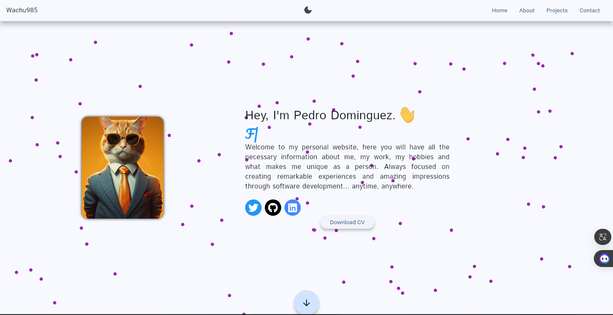
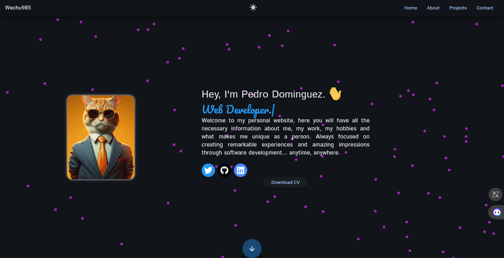

# Personal WebSite

This proyects is a personal website made with Flutter Web.

## [See the Website]([https://Loco](http://wachu985.hopto.org/))

  
  

## Running in Development

To run this web application in a development environment, follow the steps below:

Make sure you have Flutter installed. If you don't, follow the installation instructions on Flutter.
- Clone this repository to your local machine.
- Open a terminal inside the project directory and run the command `flutter pub get` to install the dependencies.
- Connect a device or start an emulator.
- Run the command `flutter run` in your terminal.

## Building the Web
If you want to build the web for distribution, you can follow these steps:

- Make sure you have completed the steps in the "Running in Development" section.
- Run the command `flutter build web` in your terminal.
- The compiled files will be available in the build directory of your project.